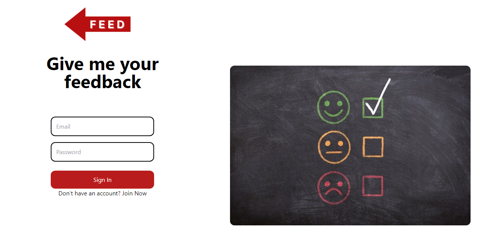

<div align="center">

> Your feedback is a feedback system used by small businesses to get feedback from its customer's 


**[PROJECT PHILOSOPHY](https://github.com/julescript/well_app#-project-philosophy) • [WIREFRAMES](https://github.com/julescript/well_app#-wireframes) • [TECH STACK](https://github.com/julescript/well_app#-tech-stack) • [IMPLEMENTATION](https://github.com/julescript/well_app#-impplementation) • [HOW TO RUN?](https://github.com/julescript/well_app#-how-to-run)**

</div>

<br><br>


> The website is a admin panel used by businesses to check allthings related to their feedback system. Admin can view the total number of feedback and discount in week, month, year. Also can check the all the feedback, and discounts. Admin can also update his profile informations.
> 
> The mobile application is used by user to view all nearst businesses and make feedback. User can seach for any business, view the feedback that he maked, check if he got a discount. 

### User Stories
- As a user, I want to make a feedback, so that I can find the nearset businesses and submit my feedback
- As a user, I want to know the businesses which I submitted my feedback, so that I can find it in feedback screen
- As a user, I want to know if I got a discount, so that I can find it in discount screen
- As a user, I want to search for any business, so that I can view its bio and make a feedback

<br><br>


> This design was planned before on paper, then moved to Figma app for the fine details.
Note that i didn't use any styling library or theme, all from scratch and using pure css modules

| Landing  | Home  |
| -----------------| -----|
|  |  |

| Feedback  | Discount  |
| -----------------| -----|
|  |  |

| Profile  |   |
| -----------------| -----|
|  |  |


<br><br>


Here's a brief high-level overview of the tech stack the Well app uses:

- This project uses React Js is a free and open-source front-end JavaScript library for building user interfaces based on UI components. It is maintained by Meta and a community of individual developers and companies.
- This project uses the React Native is an open-source UI software framework created by Meta Platforms, Inc. It is used to develop applications for Android, Android TV, iOS, macOS, tvOS, Web, Windows and UWP by enabling developers to use the React framework along with native platform capabilities

- For persistent storage (database), the website and application uses the phpmyadmin package which allows the website and application to create a custom storage schema and save it to a local database.

- To get the user location, the website and application uses geo location a package used to get the longitude and latitude of te user.


<br><br>


> Uing the above mentioned tecch stacks and the wireframes build with figma from the user sotries we have, the implementation of the app is shown as below, these are screenshots from the real app

| Landing  | Home  |
| -----------------| -----|
|  |  |

| Feedback  | Discount  |
| -----------------| -----|
|  |  |

| Profile  |   |
| -----------------| -----|
|  |  |


<br><br>


> This is an example of how you may give instructions on setting up your project locally.
To get a local copy up and running follow these simple example steps.

### Prerequisites

This is an example of how to list things you need to use the software and how to install them.
* npm
  ```sh
  npm install npm@latest -g
  ```

### Installation

_Below is an example of how you can instruct your audience on installing and setting up your app. This template doesn't rely on any external dependencies or services._

1. Get a free API Key at [https://example.com](https://example.com)
2. Clone the repo
   ```sh
   git clone https://github.com/karamalashkar/yourfeedback.git
   ```
3. Install NPM packages
   ```sh
   npm install
   ```
4. Enter your API in `config.js`
   ```js
   const API_KEY = 'ENTER YOUR API';
   ```


