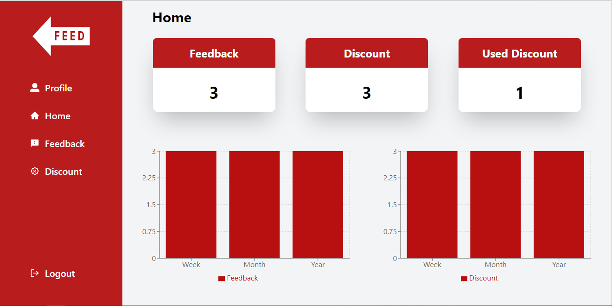

<div align="center">

> Your feedback is a feedback system used by small businesses to get feedback from its customer's 


**[PROJECT PHILOSOPHY](https://github.com/karamalashkar/yourfeedback#-project-philosophy) • [WIREFRAMES](https://github.com/karamalashkar/yourfeedback#-wireframes) • [TECH STACK](https://github.com/karamalashkar/yourfeedback#-tech-stack) • [IMPLEMENTATION](https://github.com/karamalashkar/yourfeedback#-impplementation) • [HOW TO RUN?](https://github.com/karamalashkar/yourfeedback#-how-to-run)**

</div>

<br><br>


> Your feedback is an application can be used by small businesses to get feedback from its customer. To make a feedback, user should use the mobile application, and get the feedback code from the market to be able to make one. If the user make a good feedback, he/she will get a discount from the business.
To check feedback and discounts, business owner has a website so he/she can view the number of feedback and discounts, the answers of each user, and more information about each discount offered.

### User Stories
- As a user, I want to make a feedback, so that I can find the nearset businesses and submit my feedback
- As a user, I want to view the businesses I have given my feedback to, so that I can find it in feedback screen
- As a user, I want to know if I got a discount, so that I can find it in discount screen
- As a user, I want to search for any business, so that I can view its bio and give my feedback
- As a user, I want to find the number of feedback and discounts I have, so that I can view it on my profile screen

- As a business owner, I want to know how many feedback I received, so that I can view it on my home screen
- As a business owner, I want to know how many discount I offered, so that I can view it on my home screen
- As a business owner, I want to know the number of feedback per week, month, year, so that I can view it on my home screen in the chart
- As a business owner, I want to know the number of discount per week, month, year, so that I can view it on my home screen in the chart
- As a business owner, I want to view users feedback, so that I can know their opinion
- As a business owner, I want to view the information of the discounts offered including the receiver's name and value, so that I can check it on my discount page
- As a business owner, I want to edit my profile, so that I can share information about my business


<br><br>


> This design was planned before on paper, then moved to Figma app for the fine details.
Note that i didn't use any styling library or theme, all from scratch and using pure css modules

| Landing  | Home  |
| -----------------| -----|
|  |  |

| Feedback  | Discount  |
| -----------------| -----|
|  |  |

| Profile  |   |
| -----------------| -----|
|  |  |


| Landing  | Home  |                                                
| -----------------| -----|
|  |  | 

| Business  | Feedback  |
| -----------------| -----|
|  |  |

| Discount  | Profile   |
| -----------------| -----|
|  |   |


<br><br>


Here's a brief high-level overview of the tech stack the Well app uses:

- This project uses React Js a free and open-source front-end JavaScript library for building user interfaces based on UI components, to implement the business owner panel. 

- This project uses the React Native an open-source UI software framework created by Meta Platforms. It is used to develop applications for Android, Android TV, iOS, macOS, tvOS, Web, Windows and UWP by enabling developers to use the React framework along with native platform capabilities.

- For persistent storage (database), the website and application uses the phpmyadmin software tools,intended to handle the administration of MySQL over the Web, and supports a wide range of operations on MySQL, for controlling, and organizing data. 

- To get the user location, the website and application uses geo location a package used to get the longitude and latitude of the user.

- To show the number of feedback, discount in a specific periode of time, the webiste uses rechart package, used to write charts in React applications.


<br><br>


> Uing the above mentioned tecch stacks and the wireframes build with figma from the user sotries we have, the implementation of the app is shown as below, these are screenshots from the real app

| Landing  | Home  |
| -----------------| -----|
|  |  |

| Feedback  | Discount  |
| -----------------| -----|
|  |  |

| Profil  | Edit Profile  |
| -----------------| -----|
|  |  |

| Landing  | Home  |                                                
| -----------------| -----|
|  |  | 

| Business  | Feedback Code  |
| -----------------| -----|
|  |  |

| Form  | Search   |
| -----------------| -----|
|  |   |

| Feedback  | View Feedback  |
| -----------------| -----|
|  |  |

| Discount  | Profile   |
| -----------------| -----|
|  |   |


<br><br>


> This is an example of how you may give instructions on setting up your project locally.
To get a local copy up and running follow these simple example steps.

### Prerequisites

This is an example of how to list things you need to use the software and how to install them.
* npm
  ```sh
  npm install npm@latest -g
  ```

### Installation

_Below is an example of how you can instruct your audience on installing and setting up your app. This template doesn't rely on any external dependencies or services._

1. Get a free API Key at [https://example.com](https://example.com)
2. Clone the repo
   ```sh
   git clone https://github.com/karamalashkar/yourfeedback.git
   ```
3. Install NPM packages
   ```sh
   npm install
   ```
4. Enter your API in `config.js`
   ```js
   const API_KEY = 'ENTER YOUR API';
   ```


